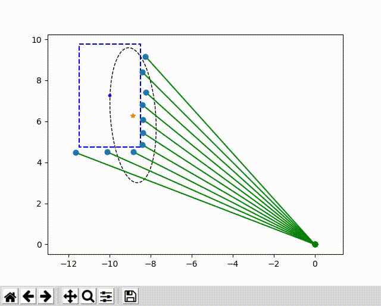

# EOT_simulator
Extended Object Tracking simulation for python


## simulator

Partly migrated from [PythonRobotics](https://github.com/AtsushiSakai/PythonRobotics) project by Atsushi Sakai

- Object model
  - [x] Rectangle car (const speed)
  - [ ] Ellipsoid object
- Sensor model
  - [x] LiDAR model
  - [ ] radar model


## tracker module

- Tracker
  - Random Matrix Tracker
    - [x] Ellipsoid(Surface)
    - [ ] Ellipsoid(Edge)
  - GM-PHD Tracker
    - [ ] Rectangle(Edge) - ongoing
    - [ ] Ellipsoid(Edge)
- Data Assosiation
  - future work


## demo (under construction)

for instant demonstration run following:

```
# cd base directory
python3 src/tracker/RandomMatrixTracker_EllipsoidSurface.py
```

- Random Matrix Tracker (inappropriate model)



## tests for developers

For the tests, run command below:

```
# cd at project home dir
python3 -m pytest --cov=tests
```

