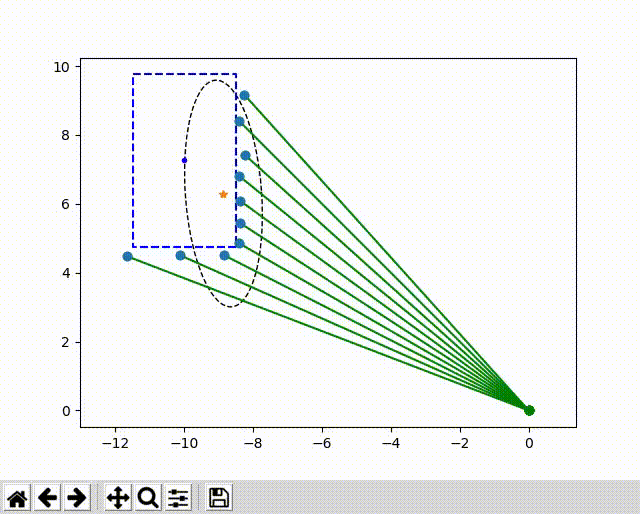

# EOT_simulator
Extended Object Tracking simulation for Python.

Estimates the position, velocity, existence probability, and shape (OBB) of multiple objects
from LiDAR / Radar point cloud measurements.


## simulator

Partly migrated from [PythonRobotics](https://github.com/AtsushiSakai/PythonRobotics) project by Atsushi Sakai

- Object model
  - [x] Rectangle car (const speed)
  - [ ] Ellipsoid object
- Sensor model
  - [x] LiDAR model (ray casting, range noise, partial observation)
  - [ ] Radar model


## tracker module

### Legacy trackers (`src/tracker/`)

Earlier implementations retained for reference:

| Tracker | Model |
|---|---|
| Random Matrix Tracker | Ellipsoid (surface) |
| GM-PHD Tracker | Rectangle (edge) — WIP |
| EKF Rectangle Tracker | Rectangle |

### New GGIW-PMBM layer (`src/tracking/`)

Full re-implementation following the two-layer architecture described in [CLAUDE.md](CLAUDE.md).

| Module | Description |
|---|---|
| `tracking/ggiw/` | Single-target GGIW state, prediction, update, likelihood |
| `tracking/measurement/` | KD-tree clustering and MeasurementCell partition |
| `tracking/pmbm/` | Bernoulli components, global hypotheses, PMBM filter |
| `tracking/shape/` | Rectangle fitting + smoothing (planned) |


## Setup

```bash
# Install uv (https://docs.astral.sh/uv/)
uv sync --extra dev
```


## demo (under construction)

For instant demonstration run:

```bash
python3 src/tracker/RandomMatrixTracker_EllipsoidSurface.py
```

- Random Matrix Tracker (inappropriate model)




## Tests

Run the full suite:

```bash
uv run pytest          # all tests
uv run pytest -v       # verbose output
uv run pytest --cov    # with coverage
```

### Test structure

```
tests/
├── test_EKF.py                         # Legacy EKF smoke tests
├── test_RectangleTracker.py            # Legacy rectangle tracker utilities
├── test_utils.py                       # Geometry helpers (rot_mat, ellipsoid, ...)
└── tracking/
    ├── test_ggiw.py                    # GGIW single-target filter
    ├── test_measurement.py             # Clustering and partition
    ├── test_pmbm.py                    # PMBM multi-object filter
    └── test_lidar_scenarios.py         # End-to-end with ray-casting LiDAR
```

### `tests/tracking/test_ggiw.py` — 27 tests

Unit tests for the GGIW (Gamma Gaussian Inverse-Wishart) single-target model.

| Class | Tests | What is verified |
|---|---|---|
| `TestGGIWState` | 6 | State construction, `extent_mean`, `rate_mean`, `position`, validation guards |
| `TestPredict` | 7 | CV-model kinematic advance, covariance growth, IW forgetting (DOF decrease, extent mean preserved), Gamma variance growth, DOF floor |
| `TestUpdate` | 10 | DOF/α increase by n, β increment, Kalman shrinkage, symmetry & PD of P, position pull, single-/multi-measurement cases, empty input guard |
| `TestLikelihood` | 4 | Positive scalar output, distance ordering, empty → zero, single measurement |

### `tests/tracking/test_measurement.py` — 23 tests

Unit tests for clustering and the `MeasurementCell` abstraction.

| Class | Tests | What is verified |
|---|---|---|
| `TestMeasurementCell` | 9 | n, centroid, scatter (zero/symmetric/PSD), invalid-shape guard, empty guard, float coercion |
| `TestClusterPoints` | 8 | Two groups, one cluster, single/empty input, `min_points` filter, three clusters, shape guard, output completeness |
| `TestPartition` | 6 | Cell type, two-object split, empty input, `min_points` forwarding, point coverage, cell usability with GGIW update |

### `tests/tracking/test_pmbm.py` — 24 tests

Unit and integration tests for the PMBM multi-object filter.

| Class | Tests | What is verified |
|---|---|---|
| `TestBernoulli` | 8 | Predict scales r, detection update sets r→1 and finite log-weight, missed update decreases r, missed log-weight formula, state preservation, r=0 stays 0 |
| `TestGlobalHypothesis` | 5 | Predict propagates tracks, empty-cell → all-missed, single track/cell assignment, no-track birth, max-hypothesis cap |
| `TestHypothesisManagement` | 5 | Prune removes low-weight / keeps ≥1, cap keeps top-N, normalise sums to 1 / preserves order |
| `TestPMBMFilter` | 6 | Initial empty hypothesis, predict on empty filter, update creates birth, single-target convergence scenario, hypothesis count bounded, missed frames reduce existence |

### `tests/tracking/test_lidar_scenarios.py` — 21 tests

End-to-end integration tests using `VehicleSimulator` + `LidarSimulator` (ray casting with multiplicative range noise).
Sensor is always at the origin; vehicles are rectangular cars generated with configurable pose, speed, width, and length.

#### `TestLidarPointCloud` — LiDAR physics (7 tests)

| Test | Scenario | Assertion |
|---|---|---|
| `test_vehicle_produces_at_least_one_point` | Single car at 10 m | ≥ 1 point returned |
| `test_points_lie_near_vehicle_surface` | Same | All points within 1 m of vehicle boundary |
| `test_finer_resolution_gives_more_points` | 1° vs 5° angular step | 1° scan has more points |
| `test_closer_vehicle_gives_more_points` | 5 m vs 20 m range | Closer returns more angular bins |
| `test_head_on_vs_side_on_point_count` | yaw=90° (long face) vs yaw=0° (short face) | Long face → more points |
| `test_partial_observation_only_near_face_visible` | Car 10 m ahead, points analyzed | No points behind car centre (partial obs) |
| `test_range_noise_within_bounds` | noise=0.1 m | All ranges within ±0.5 m of true |

#### `TestPartialObservationClustering` — clustering with real LiDAR (5 tests)

| Test | Scenario | Assertion |
|---|---|---|
| `test_single_vehicle_forms_one_cell` | 1 car, eps=2 m | Exactly 1 cluster |
| `test_two_separated_vehicles_form_two_cells` | 2 cars 20 m apart | Exactly 2 clusters |
| `test_cell_centroid_near_vehicle` | Car at (10, 0) | Centroid within 2 m of true position |
| `test_diagonal_vehicle_still_one_cell` | Car at 45° to sensor | Still 1 cluster (partial obs OK) |
| `test_sparse_scan_min_points_filter` | Very coarse scan, min_points=3 | No cell with < 3 points |

#### `TestGGIWWithLidarInput` — GGIW stability under ray-cast input (4 tests)

| Test | Scenario | Assertion |
|---|---|---|
| `test_ggiw_update_does_not_diverge_partial_observation` | Partial observation (one face) | `‖m_pos‖ < 100`, P trace finite |
| `test_ggiw_position_converges_over_frames` | 20 static frames, car at (10, 3) | Position error decreases over time |
| `test_ggiw_angled_vehicle_update_stable` | yaw=45°, 10 frames | P stays symmetric & PD after each update |
| `test_position_uncertainty_shrinks_with_observations` | 15 updates, same car | Final P trace < initial P trace |

#### `TestPMBMWithLidarScenarios` — full PMBM pipeline scenarios (5 tests)

| Test | Scenario | Assertion |
|---|---|---|
| `test_approaching_vehicle_tracked` | Car starts 20 m away, drives toward sensor at 2 m/s, 12 frames × 0.5 s | ≥ 1 estimate with position error < 5 m |
| `test_side_passing_vehicle_tracked` | Car passes laterally at constant offset, 10 frames | ≥ 1 estimate |
| `test_track_survives_missed_frames` | Established track, then 3 frames of no points, then detection resumes | Track re-detected after gap |
| `test_sparse_lidar_tracking_stable` | Coarse 10° scan (few points per frame), 10 frames | Filter does not crash; ≤ 5 estimates (no explosion) |
| `test_two_vehicles_two_estimates` | Two cars separated by 15 m, 8 frames | 2 estimates, each within 4 m of its true vehicle |
